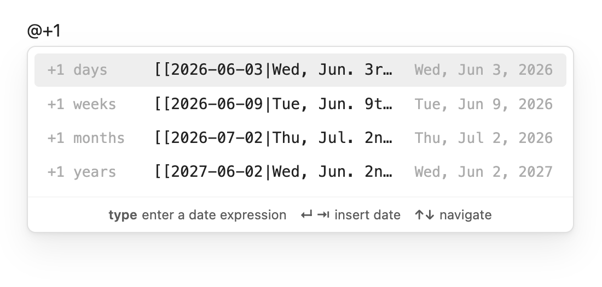
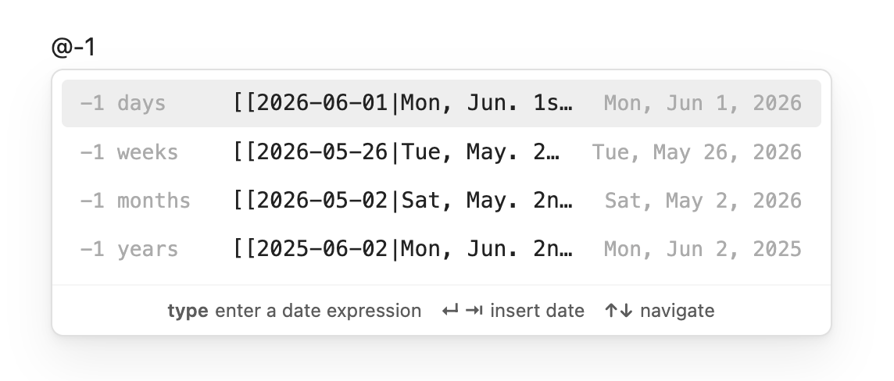
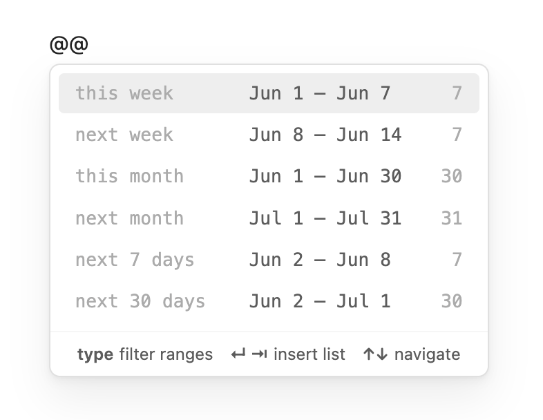

# Date List

An Obsidian plugin for inserting single dates and formatted date lists, with a live-preview wizard and inline autocomplete. This plugin is actively being developed, so create a GitHub issue if you have any trouble.

## Features

### Inline `@` autosuggest

Type `@` (or your configured trigger) anywhere in a note to open a predictive date suggestion popup. The suggestions update live as you type — press **↵** or **⇥** to insert, **↑↓** to navigate.

The popup is predictive based on what you type after `@`:

| What you type | What you get |
|---|---|
| `@` | Today, tomorrow, yesterday |
| `@t` | Presets + upcoming Tuesdays and Thursdays |
| `@mon` | Next 7 Mondays |
| `@june` | 7-day window starting from June |
| `@jun15` | 7-day window starting from June 15 |
| `@this` | Remaining days of this week |
| `@next` | All days of next week |
| `@last` | All days of last week |
| `@2026-06-15` | ISO date (full or partial: `@2026`, `@2026-06`) |
| `@20260615` | Compact date |
| `@6/15` | Slash date — shows both US (Jun 15) and EU (Jun 6) options |
| `@15 jun` | Military format (`@15 jun 2026` for a specific year) |
| `@+7` | 7 days from today in all units (days / weeks / months / years) |
| `@+7d` | 7 days from today (`d`, `w`, `m`, `y` or full words like `days`) |
| `@+` / `@-` | Tomorrow / yesterday |

---

### Inline `@@` date list autosuggest

Type `@@` (or your configured list trigger) to open a range picker that inserts a full list of dates at the cursor. Press **↵** or **⇥** to insert, **↑↓** to navigate.

Six presets appear immediately:

| What you type | What you get |
|---|---|
| `@@` | All six presets |
| `@@this` | This week, this month |
| `@@next` | Next week, next month, next 7 days, next 30 days |
| `@@next 14 days` | Jun 2 – Jun 15 (14 dates) |
| `@@next 3 weeks` | 21 dates starting today |
| `@@next 2 months` | ~61 dates starting today |

Each row shows the label, the date range, and the number of dates. The inserted list uses your configured format, prefix, postfix, and wiki link settings.

---

### Quick Insert

**Date List: Quick insert** drops a single formatted date at the cursor. Pick from common presets or type any custom date expression.

You can also use a calendar popup:

The inserted date uses your configured default format, wiki links, and alias settings.

---

### Insert Date List

Quickly add a list of dates according to your search criteria. The most common options are provided first: this week, next week, this month, etc.

Alternately, you can just return the next *n* number of days, say for example if you are going on a ten day vacation and you want to plan your itinerary.

Open the command palette and run **Date List: Insert date list**. The first screen shows six common range presets (this week, next week, this month, etc.) — click or press the matching number to insert immediately.

For a custom range, choose **Custom…** (option 7) to expand an inline date picker with four methods:

| Method | What it generates |
|--------|------------------|
| **Between** | All dates from a specific start date to a specific end date |
| **In the next** | N days / weeks / months / years forward from today |
| **In the past** | N days / weeks / months / years back to today |
| **Duration** | N days / weeks / months / years forward from a chosen start date |

All date fields accept natural language input.

A **⚙ Configure format…** button is available on every screen to set the date format, wiki links, prefix, and postfix before inserting.

---

### Filter Dates

The **Date List: Filter dates** command allows you to find all instances of a specific day given the search parameters. For example, you can easily find the weekends for the next three months, or the dates of a recurring meeting you have.

---

### Configure Date List

Every time you enter a date, you can choose from a default format or customize it on the fly. The plugin supports wiki links, aliases, and any date format you can think of.

In the plugin settings, you can customize your default preferences. For example, if you use Daily Notes, you may have a dating convention like YYYY-MM-DD, but prefer a more readable format in the alias. 

In the plugin settings, you can customize your default date format preferences and trigger characters. For example, if you use Daily Notes, you may have a dating convention like YYYY-MM-DD, but prefer a more readable format in the alias.

The **inline date trigger** (default `@`) and **inline date list trigger** (default `@@`) can each be changed to any character or sequence that doesn't conflict with other plugins.

**Date List: Configure** runs a wizard to set your format defaults without inserting anything — useful for changing defaults without having to insert a list first.

---

## Keyboard navigation

All screens support full keyboard control:

- **↑ / ↓** — move between options
- **1, 2, 3…** — jump to option by number
- **Enter** — confirm the focused option
- **Escape / ←** — go back
- **OK button** — available on every screen for mouse-only users

## Known conflicts

### Various Complements

The [Various Complements](https://github.com/tadashi-aikawa/obsidian-various-complements-plugin) plugin conflicts with the `@` and `@@` inline triggers. After you type a second character, Various Complements fires its own suggestion popup and dismisses the date-list popup. Backspacing to one character restores it because Various Complements requires at least two characters to activate.

**Workaround:** In Various Complements settings, increase *Min number of characters for completion* to 3 or higher. This prevents it from triggering while you are still typing a short date expression.

---

## Related plugins

If you like Date List, you might also like [Calendar List](https://community.obsidian.md/plugins/calendar-list) — a companion plugin that pulls events from your macOS Calendar app and inserts them into your notes.

## Feedback and contributions

Let me know if you have any feedback or suggestions! 
